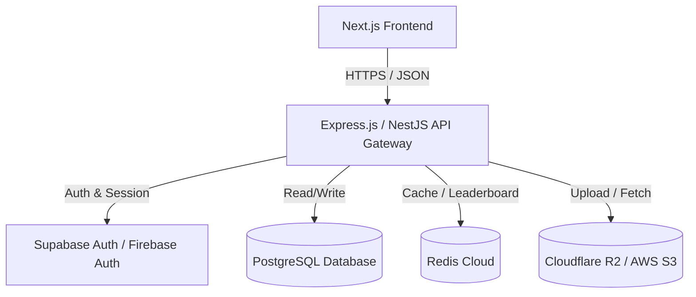
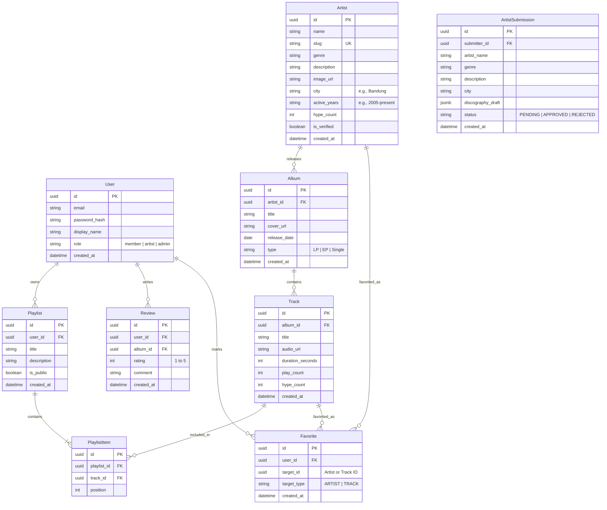

# Product Requirements Document (PRD)
## Backend Services for SkenduyList (Indonesian Indie Music Archive)

---

## 1. Executive Summary
**SkenduyList** is a digital archive and discovery platform dedicated to the vibrant Indonesian indie music scene ("Skena"). Currently, the application is a static Next.js frontend with local mock data. 

To transform SkenduyList into a living community hub, the backend must support:
- A dynamic music catalog (artists, albums, tracks).
- User authentication and personalization (favorites, custom playlists).
- Social interactions ("hype" count, comments, reviews).
- A community submission system enabling indie artists to submit their bios and music links for administrator moderation.
- A basic audio streaming system.

This document outlines the functional and non-functional requirements, data schemas, API specifications, and architectural design for the SkenduyList backend.

---

## 2. Product Goals
1. **Enable Skena Discovery**: Move away from hardcoded mock data to support a growing, searchable database of indie artists.
2. **Drive Community Engagement**: Allow music lovers to create custom playlists, bookmark favorites, rate albums, and express appreciation via "hypes."
3. **Empower Indie Artists**: Provide a submission portal for bands to submit their bios and discographies to the platform.
4. **Ensure Scalability & Reliability**: Build a light, high-performance API that serves search results, analytics, and music details quickly.

---

## 3. User Roles & Permissions

| Role | Description | Permissions |
| :--- | :--- | :--- |
| **Guest (Unauthenticated)** | General visitor exploring the platform. | Search/browse artists, view biography, view tracks/albums, play previews. |
| **Member (Authenticated)** | Music enthusiast. | All Guest features, plus: create playlists, favorite artists/tracks, post reviews/comments, "hype" tracks, and submit new artists. |
| **Artist (Authenticated)** | Verified musician or band manager. | All Member features, plus: claim artist profile, manage band profile (requires approval), and view listening/interaction analytics. |
| **Administrator** | Content moderators and system owners. | All features, plus: approve/reject artist submissions, moderate comments, manage database content, and view system metrics. |

---

## 4. Key Backend Features (Functional Requirements)

### 4.1. Catalog Management Service
* **Dynamic Entities**: API endpoints to manage `Artists`, `Albums`, and `Tracks`.
* **Metadata Richness**: Extend metadata to support artist regions (e.g., Bandung, Jakarta, Yogyakarta), active eras (e.g., 2000s, 2010s), and external links (Spotify, YouTube, Bandcamp).
* **Media Assets**: Integration with cloud storage for album art images and track audio files (mp3).

### 4.2. User & Library Service
* **Authentication**: JWT-based authentication supporting Email/Password sign-in and OAuth (Google / Spotify).
* **Favorites**: User capability to "bookmark" artists, albums, or tracks.
* **Playlists**: Complete CRUD for user playlists (Private vs. Public, custom title, description, and list of tracks).

### 4.3. Skena Engagement Engine
* **Hype System**: A unique upvoting metric ("Hype") instead of generic likes. Users can "hype" tracks or artists, feeding into the trending algorithm.
* **Reviews & Ratings**: Threaded comments and 1-5 star ratings on Albums.
* **Trending Algorithm**: A background cron or Redis-based leaderboard calculating hot tracks based on hypes and plays in the last 7 days.

### 4.4. Artist Submission Portal
* **Submission Pipeline**: Form endpoint where members can submit a new artist with name, genre, description, albums, and tracks.
* **Approval Dashboard**: API to list, approve, or reject pending submissions, automatically adding approved entries to the main catalog.

### 4.5. Search & Discovery API
* **Fuzzy Search**: Search for tracks, albums, and artists with auto-completion and spelling tolerance.
* **Categorized Discovery**: Filtering by genre, release year, regional scene (city), and active era.

---

## 5. System Architecture & Tech Stack

### Proposed Stack:
* **Framework**: Node.js with **NestJS** (or **Express.js** + TypeScript) for structured, scalable REST API.
* **Database**: **PostgreSQL** for rich relational structures (artists have albums, albums have tracks, users have playlists).
* **ORM**: **Prisma** or **Drizzle ORM** for type-safe database queries.
* **Caching**: **Redis** for storing search indexes, trending charts, and caching heavy queries.
* **Authentication**: **Supabase Auth** or **Auth.js (NextAuth)** to handle OAuth and JWT sessions securely.
* **File Storage**: **Cloudflare R2** or **AWS S3** for hosting audio files and artist/album covers.

---

## 6. Database Schema (Entity-Relationship)

---

## 7. API Endpoint Specification

### 7.1. Authentication
* `POST /api/auth/register` - Create a new user profile.
* `POST /api/auth/login` - Authenticate and retrieve JWT token.
* `GET /api/auth/me` - Retrieve current user session.

### 7.2. Music Catalog
* `GET /api/artists` - Fetch artists with optional query filters (`genre`, `city`, `era`, `search`).
* `GET /api/artists/:slug` - Fetch detailed profile of a single artist, including albums, tracks, and related artists.
* `POST /api/artists` [Admin Only] - Add new artist.
* `GET /api/albums/:id` - Fetch album details.
* `GET /api/tracks/trending` - Fetch top hypes/plays calculated dynamically.

### 7.3. Interaction & Socials
* `POST /api/tracks/:id/hype` - Increment the hype count of a track (requires authentication, limit 1 per user/track).
* `POST /api/albums/:id/reviews` - Post a review and rating for an album.
* `GET /api/albums/:id/reviews` - Get all reviews for an album.

### 7.4. User Playlists & Library
* `GET /api/users/favorites` - Get user's favorited artists and tracks.
* `POST /api/users/favorites` - Add artist/track to favorites.
* `GET /api/playlists` - Get authenticated user's playlists.
* `POST /api/playlists` - Create a new playlist.
* `PUT /api/playlists/:id` - Add/remove tracks or edit playlist details.

### 7.5. Artist Submission (Crowdsourcing)
* `POST /api/submissions` - Submit a new band/artist proposal.
* `GET /api/submissions` [Admin Only] - List pending submissions.
* `POST /api/submissions/:id/approve` [Admin Only] - Approve a submission (moves data to `Artist`/`Album`/`Track` tables).
* `POST /api/submissions/:id/reject` [Admin Only] - Reject submission.

---

## 8. Non-Functional Requirements

### 8.1. Performance & Latency
* **Response Time**: Search API and Catalog Fetch API response times should be under **200ms** (using Redis caching for high-demand endpoints).
* **Media Serving**: Audio files must support progressive HTTP byte-range requests for smooth playback scrubbing.

### 8.2. Security
* **Access Control**: Role-based access control (RBAC) enforced on administration and moderation endpoints.
* **Rate Limiting**: Implementation of API rate limiting (e.g., max 100 requests per minute per IP for catalog; max 5 submissions per day per user).
* **Input Sanitization**: Rich text descriptions and reviews must be sanitized to prevent Cross-Site Scripting (XSS).

### 8.3. Monitoring & Analytics
* Logs tracking playback counts (to feed recommendations and popular charts).
* System logging using winston/pino with errors piped to Sentry or OpenTelemetry-compatible collectors.

---

## 9. Phased Implementation Roadmap

### Phase 1: MVP Backend & Catalog Sync (Weeks 1-2)
- Set up NestJS server, Prisma ORM, and PostgreSQL database.
- Seed database with existing 5 bands from `data/artists.ts`.
- Expose basic REST endpoints for reading artists, albums, and tracks.
- Integrate the frontend search bar and detail pages with live backend routes.

### Phase 2: Auth, Favorites & Playlists (Weeks 3-4)
- Integrate NextAuth.js or Supabase Auth.
- Implement User registration/login.
- Implement Favorites (like/hype bands and tracks).
- Implement Playlist CRUD APIs and link them to user profile views.

### Phase 3: Submissions & Moderation (Week 5)
- Create submission forms for users to contribute to the archive.
- Build an Admin panel UI and corresponding backend validation endpoints to review submissions.

### Phase 4: Audio Streaming & Trending Charts (Week 6)
- Connect Cloudflare R2 / AWS S3 storage for track audio files.
- Enable basic audio playback in frontend by referencing backend file streams.
- Implement the "Trending Now" calculation worker in Redis.
